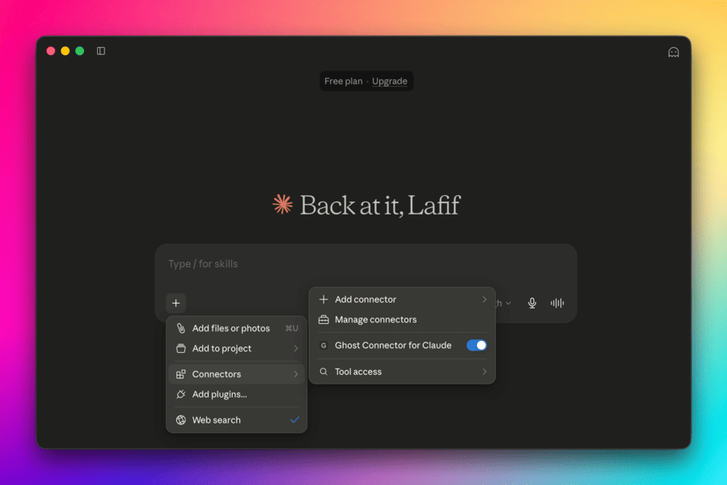

# Ghost Connector for Claude

<p align="center">
  
</p>

[](#license)
[](#development)
[](https://claude.ai)
[](https://github.com/qutek/ghost-connector-claude-extension/releases)

Connect Claude to your Ghost CMS blog and run your entire publishing workflow through conversation. Draft posts from an outline, manage newsletter members, swap themes, audit drafts — no admin-panel clicking, no copy-paste.

<p align="center">
  
</p>

>Write, publish, and manage your Ghost blog directly from Claude Desktop. [Watch the demo](https://cln.sh/NCNJ3ZFh)

---

## What you can do

- **📝 Write posts in plain English** — describe what you want; Claude drafts and saves to Ghost as draft or published.
- **👥 Manage members** — add, update, label, and subscribe newsletter members without touching the Ghost admin.
- **🏷️ Organize tags & authors** — build your content taxonomy conversationally.
- **💰 Configure tiers & newsletters** — manage paid memberships and subscription settings.
- **🎨 Activate themes** — switch your site's appearance in one command.
- **🖼️ Upload media** — add images from your machine to Ghost's media library.
- **🔔 Register webhooks** — wire Ghost events to other services.

35 tools covering the full Ghost Admin API surface.

---

## Install

### Path A — Claude Desktop (recommended, one-click)

1. Download the latest version from the [releases page](https://github.com/qutek/ghost-connector-claude-extension/releases).
2. Open **Claude Desktop** → **Settings** → **Connectors** → **Add connector**.
3. Select the downloaded `.mcpb` file.
4. Enter when prompted:
   - **Ghost blog URL** — e.g. `https://myblog.ghost.io`
   - **Staff Admin API key** — see [getting your API key](#getting-your-api-key) below.
5. Ask Claude: *"Connect to my blog and confirm it's working."*

### Path B — Manual (developers)

```bash
git clone https://github.com/qutek/ghost-connector-claude-extension.git
cd ghost-connector
npm install
npm run build
node build/server/index.js
```

Then add to Claude Desktop's MCP config (or use the `.mcpb` via `npm run pack`):

```json
{
  "mcpServers": {
    "ghost-connector": {
      "command": "node",
      "args": ["/absolute/path/to/ghost-connector/build/server/index.js"],
      "env": {
        "GHOST_URL": "https://myblog.ghost.io",
        "GHOST_API_KEY": "5c9e3bf3e2babc0b3a4f5e6d:..."
      }
    }
  }
}
```

---

## Getting your API key

The key lives in Ghost's admin panel:

1. Log in to your Ghost admin (e.g. `https://myblog.ghost.io/ghost`).
2. Go to **Settings** ⚙️ → **Integrations** → **Add custom integration**.
3. Name it (e.g. "Claude Desktop").
4. Copy the **Admin API Key** — it looks like:
   ```
   5c9e3bf3e2babc0b3a4f5e6d:a1b2c3d4e5f6a7b8c9d0e1f2a3b4c5d6e7f8a9b0c1d2e3f4a5b6c7d8e9f0a1b2
   ```
   Format: `<24-char hex id>:<64-char hex secret>`.
5. Paste into Claude Desktop's connector settings.

<!-- TODO: screenshot of Ghost admin Integrations page highlighting the key -->

> ⚠️ **Use the Staff/Admin API key**, not the Content API key. The Content API key can only read; this connector needs the Admin key to create, update, and publish.

---

## Quick start

Once installed, try these prompts in Claude Desktop:

| You say… | What happens |
|---|---|
| *"Connect to my blog"* | Claude runs `ghost_whoami`, confirms your site name + that credentials work |
| *"Write a 500-word post about remote-first teams and save it as a draft"* | Claude drafts, calls `ghost_create_post` with `status: draft` |
| *"List all my draft posts with their tags"* | `ghost_list_posts` with `filter: status:draft, include: tags` |
| *"Add a member `alice@example.com` to the paid tier"* | `ghost_create_member` then `ghost_update_member` |
| *"Swap the active theme to Casper"* | `ghost_activate_theme` |

---

## Tools reference

35 tools, grouped by domain. Full arg schemas live in [`src/tools/`](src/tools/).

### Posts (5)
| Tool | Description |
|---|---|
| `ghost_list_posts` | List posts (max 50, filterable, e.g. `status:published`). |
| `ghost_get_post` | Fetch one post by id; `include: tags,authors` for full detail. |
| `ghost_create_post` | Create a draft/published post. Accepts `lexical`, `mobiledoc`, `html`, or `content` (markdown-ish). |
| `ghost_update_post` | Update a post; requires current `updated_at` (fetch first). |
| `ghost_delete_post` | Permanently delete a post by id. |

### Pages (5)
| Tool | Description |
|---|---|
| `ghost_list_pages` | List pages. Same params as `ghost_list_posts`. |
| `ghost_get_page` | Fetch one page by id. |
| `ghost_create_page` | Create a page. Same body shape as posts. |
| `ghost_update_page` | Update a page; requires `updated_at`. |
| `ghost_delete_page` | Permanently delete a page by id. |

### Tags (5)
| Tool | Description |
|---|---|
| `ghost_list_tags` | List tags; filter e.g. `visibility:public`. |
| `ghost_get_tag` | Fetch one tag by id. |
| `ghost_create_tag` | Create a tag (name required). |
| `ghost_update_tag` | Update a tag by id. |
| `ghost_delete_tag` | Permanently delete a tag by id. |

### Authors / Users (3)
| Tool | Description |
|---|---|
| `ghost_list_authors` | List staff users/authors. |
| `ghost_get_author` | Fetch one user by id. |
| `ghost_update_author` | Update profile fields (name, bio, socials, images). Owner-only fields enforced by Ghost. |

### Members (5)
| Tool | Description |
|---|---|
| `ghost_list_members` | List members; filter e.g. `status:paid`. |
| `ghost_get_member` | Fetch one member by id. |
| `ghost_create_member` | Create a member (email required). |
| `ghost_update_member` | Update a member by id. |
| `ghost_delete_member` | Permanently delete a member by id. |

### Tiers & Newsletters (3)
| Tool | Description |
|---|---|
| `ghost_list_tiers` | List membership tiers (free/paid). |
| `ghost_update_tier` | Update tier name, description, visibility, active flag. |
| `ghost_list_newsletters` | List configured newsletters. |

### Settings (2)
| Tool | Description |
|---|---|
| `ghost_get_settings` | Fetch site settings (title, description, logo, navigation, timezone). |
| `ghost_update_settings` | Update settings. Each entry: `{key, value}`. Affects the live site. |

### Themes (2)
| Tool | Description |
|---|---|
| `ghost_list_themes` | List installed themes. |
| `ghost_activate_theme` | Activate a theme by name. Changes the live site. |

### Media (1)
| Tool | Description |
|---|---|
| `ghost_upload_image` | Upload an image (local file path) to Ghost's media library. Max 25 MB. Returns `{url, ref}`. |

### Webhooks (3)
| Tool | Description |
|---|---|
| `ghost_create_webhook` | Create a webhook. Required: `event` + `target_url`. Optional: `name`, `secret`, `api_version`. |
| `ghost_update_webhook` | Update a webhook (event, target_url, name, api_version). |
| `ghost_delete_webhook` | Delete a webhook by id. |

> Ghost Admin API does not expose a list endpoint for webhooks — create, update, delete only ([docs](https://ghost.org/docs/admin-api/webhooks/)).

### Meta (1)
| Tool | Description |
|---|---|
| `ghost_whoami` | Connection sanity check — returns site title, description, timezone, version. **Call this first after install.** |

---

## Examples

### Draft a post from an outline

> *"Here's an outline for a post on 'Hiring without whiteboards':*
> *1. Why take-home problems are broken*
> *2. What pair programming reveals*
> *3. A 4-step process that works*
> *Write ~800 words and save as a draft tagged 'engineering', 'hiring'."*

Claude will: look up the tag ids → draft the body → call `ghost_create_post` with `status: draft`, `tag_ids: [...]`.

### Publish all drafts tagged "news"

> *"Find every draft tagged 'news' and publish them."*

Claude chains: `ghost_list_posts filter: status:draft+tag:news, include: tags` → for each, `ghost_update_post` with `status: published`.

### Audit draft posts

> *"Show me drafts older than 30 days with no feature image."*

`ghost_list_posts filter: status:draft` → Claude inspects `updated_at` and `feature_image` and reports.

---

## Troubleshooting

| Error | Fix |
|---|---|
| `Invalid Ghost Admin API key format. Expected '<24hex_id>:<64hex_secret>'` | You copied the wrong key. Re-copy from Ghost Admin → Integrations → your custom integration. Must be 24 chars `:` 64 chars, all hex. |
| `Ghost API … failed: 401` | Key is invalid or lacks Staff role. Re-issue the key in Ghost admin. |
| `Ghost API … failed: 404` | Blog URL is wrong, or the resource id doesn't exist. Check trailing slashes in the URL. |
| `Ghost API … network error` | Timeout or unreachable. Confirm your machine can reach the blog URL (try it in a browser). |
| `Unknown tool: …` | Restart Claude Desktop after installing the connector. |
| Connector installed but Claude doesn't see tools | Re-open the connector settings and confirm the blog URL + key are saved. |

---

## Security

- **Your Admin API key is stored in the OS keychain** (via Claude Desktop's `sensitive: true` config flag), never in plaintext.
- Every API request is authenticated with a **short-lived (5-minute) signed JWT** derived from your key. The key itself is never sent to Ghost.
- The connector runs **locally on your machine** (MCPB bundle); no third-party server sees your traffic.
- `ghost_upload_image` reads files you explicitly reference by path — it cannot browse your filesystem.

---

## Development

### Scripts

```bash
npm test            # 48 tests (node:test + experimental TS stripping)
npm run build       # esbuild bundle -> build/server/index.js
npm run pack        # produce .mcpb via @anthropic-ai/mcpb
npm run validate    # validate manifest + bundle
npm run inspector   # launch mcp-inspector for interactive debugging
```

### Architecture

```
src/
├── index.ts              Boot + McpServer registration loop
├── ghost.ts              GhostClient: JWT signing, retries, GhostApiError
├── lexical.ts            Content body helpers: html/content → ?source=html (server-side Lexical)
└── tools/
    ├── _shared.ts        ToolDef type + shared Zod schemas
    ├── posts.ts          5 post tools
    ├── pages.ts          5 page tools
    ├── tags.ts           5 tag tools
    ├── authors.ts        3 author/user tools
    ├── members.ts        5 member tools
    ├── site.ts           tiers + newsletters + settings + themes (7 tools)
    ├── integrations.ts   media + webhooks (4 tools)
    └── meta.ts           whoami (1 tool)
```

**TypeScript end-to-end.** Zod schemas are the single source of truth — drive both the MCP JSON schema and runtime validation. esbuild transpiles to a single CJS bundle; the manifest's `entry_point` points at the bundled output.

### Requirements

- Node.js ≥ 20 (for `globalThis.fetch`, `AbortSignal.timeout`, `FormData`).
- A Ghost site (self-hosted or Ghost Pro) with Admin API access.

---

## Contributing

See [CONTRIBUTING.md](CONTRIBUTING.md) for the development workflow, changeset conventions, and the automated release process.

---

## License

MIT © [Lafif Astahdziq](https://lafif.me)

---

## Contributing

Issues and PRs welcome — please [file them here](https://github.com/qutek/ghost-connector-claude-extension/issues). For feature requests, describe the Ghost workflow you want to automate — most additions belong as a new tool in `src/tools/<domain>.ts`.

Ghost Admin API docs: <https://ghost.org/docs/admin-api/>
